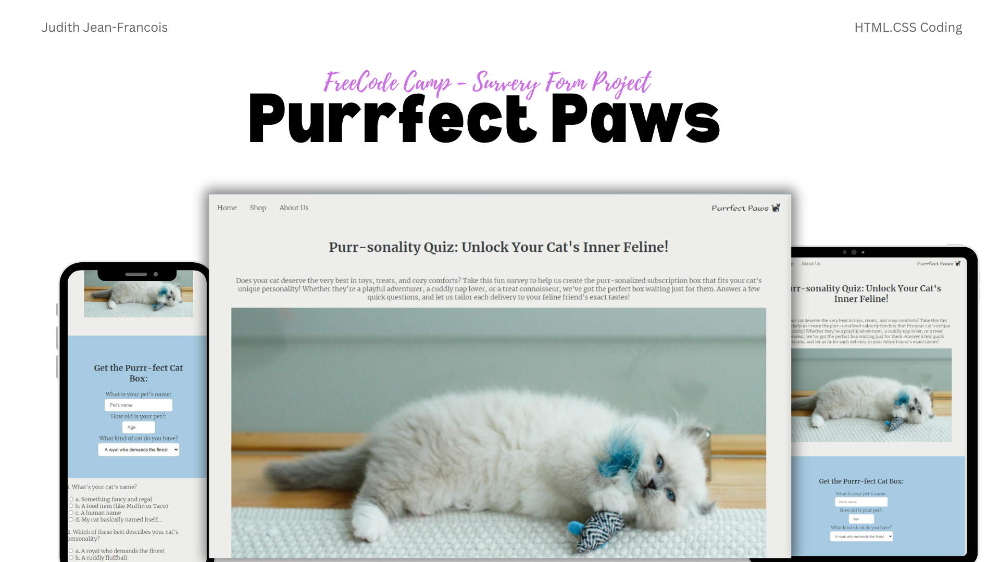

# Survey Form

## Table of contents

- [Overview](#overview)
  - [The challenge](#the-challenge)
  - [Screenshot](#screenshot)
  - [Links](#links)
- [My process](#my-process)
  - [Built with](#built-with)
  - [What I learned](#what-i-learned)

## Overview

This project is a fun and interactive cat personality quiz form, created as part of a FreeCodeCamp project. The quiz helps cat owners discover their pet's personality and recommends items for a monthly subscription box called "Purrfect Paws," designed to cater to the unique traits of each cat.

### The challenge

The challenge involved creating a survey form that gathers user input while being visually appealing and easy to navigate. The form includes various elements such as text inputs, radio buttons, checkboxes, and a submit button.

The form meets the following requirements:

- A page title in an h1 element with an id of "title."
- A short explanation in a p element with an id of "description."
- A form element with an id of "survey-form" that includes:
  - An input field for the cat's name with an id of "name" (type="text").
  - An input field for email with an id of "email" (type="email"), featuring HTML5 validation.
  - An input field for the cat's age with an id of "number" (type="number") with min/max attributes and validation.
  - Labels for the name, email, and number fields with respective ids: "name-label," "email-label," and "number-label."
  - Placeholder text in the name, email, and number fields.
  - A select dropdown element with an id of "dropdown" and multiple options.
  - A group of radio buttons, grouped using the name attribute, to capture personality traits.
  - Multiple checkboxes for box customizations.
  - A textarea for additional comments.
  - A submit button with an id of "submit."

### Screenshot

### Links

- Solution URL: [https://github.com/Jud1th1/SurveyForm-](https://github.com/Jud1th1/SurveyForm-)
- Live Site URL: [https://purrfectpawssubscribe.netlify.app/](https://purrfectpawssubscribe.netlify.app/)

## My process

1. **Planning**: I started by mapping out the quiz's structure and flow. I aimed to make it both functional and visually engaging for users while adhering to the given requirements. This included designing the form layout and ensuring accessibility and validation. I sketched out a layout that would feature personal anecdotes, images, and educational content in a clear and engaging manner.

2. **Design and Styling**: I focused on creating a playful, user-friendly design, using bright colors and an inviting layout. I ensured that the form was responsive and visually appealing on desktop, as per the requirement, while maintaining basic functionality on mobile.

3. **Frontend Development**: The form was built using HTML for structure and CSS for styling. The form elements were designed with placeholders and labels to improve user experience, while validation (such as the email and number inputs) followed HTML5 standards.

### Built with

- HTML
- CSS

### What I learned

This project helped me refine my understanding of form validation, responsiveness, and overall user experience design. It was a good exercise in creating a quiz interface that is both engaging and functional while adhering to specific coding requirements.
